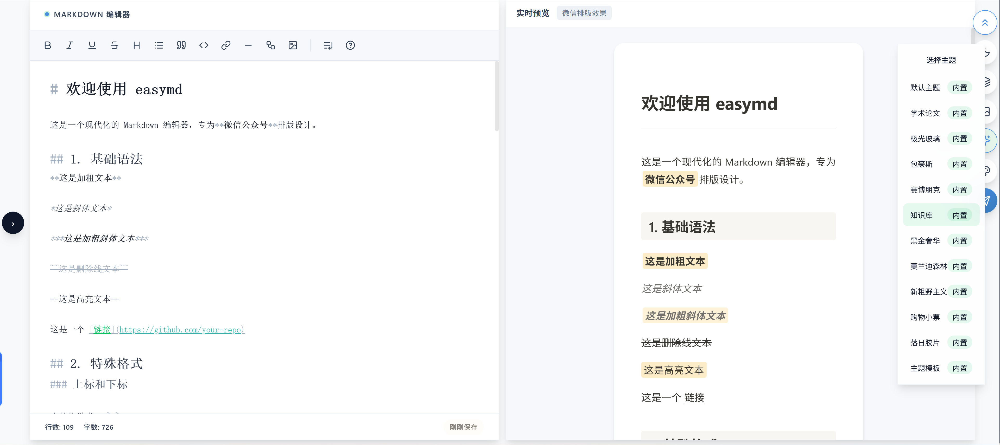

# EasyMD

<p align="center">
  <strong>简单易用的 Markdown 公众号排版工具</strong>
</p>

<p align="center">
  告别复杂工具，专注于内容创作。Markdown 写作，一键复制到公众号。
</p>

<p align="center">
  <a href="https://easymd.app">🌐 官网</a> •
  <a href="https://edit.easymd.app">✏️ 在线使用</a> •
  <a href="https://easymd.app/docs">📖 文档</a> •
  <a href="https://github.com/tenngoxars/EasyMD/releases">📦 下载桌面版</a>
</p>

<p align="center">
  <a href="LICENSE"></a>
  
  
  
  
</p>

---

## 📸 截图


---
## ✨ 特性

|     | 功能             | 说明                                                    |
| --- | ---------------- | ------------------------------------------------------- |
| 📝  | **Markdown 语法** | 支持 GFM、表格、代码高亮、数学公式                      |
| 🎨  | **主题切换**     | 内置十余款精美主题，支持可视化设计器或自定义 CSS        |
| 📋  | **一键复制**     | 完美兼容微信公众号，所见即所得                          |
| 🖼️  | **多图床支持**   | 官方图床 / 七牛云 / 阿里云 / 腾讯云 / S3 兼容           |
| 💾  | **本地优先**     | 数据存储在本地，无需登录，隐私安全                      |
| 📱  | **跨平台**       | Web 端 + 桌面端（macOS / Windows / Linux）              |
| 🌙  | **界面风格**     | 亮色 / 深色 双模式可选                                  |
| 👁️  | **深色模式预览** | 预览微信深色模式效果，还原度达 98%+                     |
| 🔍  | **高级搜索**     | 支持正则匹配、全词匹配、批量替换                        |
| 🎞️  | **滑动图组**     | 支持水平滑动的多图展示组件，丰富视觉体验                |
| 📊  | **Mermaid 图表** | 内置流程图、时序图、甘特图等多种图表，自动适配主题配色  |

---

## 🛠️ 技术栈

### 核心框架
- **前端**: React 18 + TypeScript + Vite
- **桌面端**: Electron 28
- **后端服务**: NestJS (图片上传服务)
- **状态管理**: Zustand
- **编辑器**: CodeMirror 6

### 核心依赖
- **Markdown 解析**: markdown-it 及相关插件
- **数学公式**: KaTeX / MathJax
- **图表支持**: Mermaid
- **代码高亮**: highlight.js
- **样式处理**: juice (内联样式处理)

### 工程化
- **Monorepo**: pnpm workspaces
- **构建工具**: Turborepo
- **代码规范**: ESLint + Prettier + Husky
- **容器化**: Docker + Nginx

---

## 🚀 快速开始

### 在线使用

直接访问 **[edit.easymd.app](https://edit.easymd.app)** 即可开始写作，无需安装，同样支持纯本地存储。

### 桌面版下载

前往 [Releases](https://github.com/tenngoxars/EasyMD/releases) 下载对应平台安装包：

- **macOS**: `.dmg`（Intel 版）/ `-arm64.dmg`（Apple Silicon 版）
- **Windows**: `.exe`
- **Linux**: `.AppImage`

> ⚠️ **macOS 用户注意**：首次打开时如提示"应用已损坏"，请在终端执行：
> ```bash
> xattr -cr /Applications/EasyMD.app
> ```

> ⚠️ **Windows 用户注意**：如 SmartScreen 提示"未知发布者"，点击「更多信息」→「仍要运行」

### Docker 部署

```bash
# 构建镜像
docker build -t easymd .

# 运行容器
docker run -d -p 8080:80 --name easymd easymd
```

访问 `http://localhost:8080` 即可使用。

---

## 💻 本地开发

### 环境要求

- Node.js ≥ 18
- pnpm ≥ 9（推荐 `corepack enable pnpm`）

### 安装依赖

```bash
pnpm install
```

### 开发模式

```bash
# 启动 Web 开发服务器
pnpm dev:web

# 启动桌面端（需先启动 Web）
pnpm dev:desktop
```

### 构建

```bash
# 构建所有项目
pnpm build

# 构建 Web
pnpm --filter @easymd/web build

# 构建桌面应用
pnpm --filter easymd-electron run build:mac    # macOS
pnpm --filter easymd-electron run build:win    # Windows
pnpm --filter easymd-electron run build:linux  # Linux
```

### 代码检查

```bash
# ESLint 检查
pnpm lint

# Prettier 格式化
pnpm format
```

---

## 📁 项目结构

```
EasyMD/
├── apps/
│   ├── web/          # React + Vite 前端应用
│   ├── electron/     # Electron 桌面端应用
│   └── server/       # NestJS 图片上传服务
├── packages/
│   └── core/         # 核心包：Markdown 解析 / 主题 / 工具函数
├── templates/        # 主题 CSS 模板
├── scripts/          # 构建和开发脚本
├── turbo.json        # Turborepo 配置
├── pnpm-workspace.yaml  # pnpm 工作区配置
└── package.json      # 根包配置
```

### 目录说明

- **apps/web**: 主前端应用，使用 React + Vite 构建
- **apps/electron**: 桌面端封装，使用 Electron 打包
- **apps/server**: 提供图片上传 API 服务（支持多图床）
- **packages/core**: 共享核心逻辑，包括 Markdown 解析、主题渲染、微信深色模式算法等

---

## 💡 核心功能详解

### 微信深色模式预览

EasyMD 内置了一套**色彩语义保全算法**，可在编辑器中预览微信公众号深色模式下的实际效果，还原度达 **98% 以上**。

该算法基于微信官方开源的核心算法迁移并优化，旨在保证高性能 CSS 转换的同时提供最接近官方的渲染效果。

- 智能识别不同元素类型，分别优化
- HSL 色彩空间计算，确保视觉一致性

> 这可能是目前市面上除官方外唯一针对微信公众号深色模式预览的开源解决方案。

### 多图床支持

支持多种图床平台，满足不同用户需求：

- 官方图床
- 七牛云 Kodo
- 阿里云 OSS
- 腾讯云 COS
- Amazon S3 兼容

### 主题系统

- 内置十余款精美主题
- 支持自定义 CSS
- 提供可视化主题设计器
- 主题可导出分享

---

## 📸 截图


---

## 🤝 贡献指南

我们欢迎任何形式的贡献！

1. Fork 本仓库
2. 创建你的特性分支 (`git checkout -b feature/AmazingFeature`)
3. 提交你的更改 (`git commit -m 'Add some AmazingFeature'`)
4. 推送到分支 (`git push origin feature/AmazingFeature`)
5. 打开一个 Pull Request

### 开发规范

- 遵循 ESLint 和 Prettier 配置
- 提交前会通过 Husky + lint-staged 自动检查
- 提交信息请遵循 [Conventional Commits](https://www.conventionalcommits.org/) 规范

---

## 💬 反馈与支持

- **Issues**: 遇到问题？请提交 [Issue](https://github.com/tenngoxars/EasyMD/issues)
- **讨论**: 想要新功能？来 [Discussions](https://github.com/tenngoxars/EasyMD/discussions) 告诉我们
- **邮件**: 其他问题？发送邮件至 support@easymd.app

---

## 📄 开源协议

[MIT](LICENSE) © EasyMD Team

---

## ⭐ Star History

如果这个项目对你有帮助，请考虑给我们一个 Star ⭐️

---

<p align="center">
  Made with ❤️ by EasyMD Team
</p>
